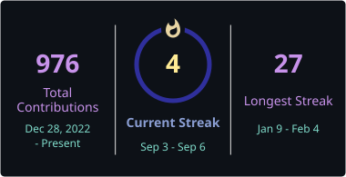

<!-- Header wave -->


<br/>

<!-- Social links row -->
<div align="center">

[](mailto:thanhtrieunguyen2004@gmail.com)
&nbsp;
[](https://github.com/thanhtrieunguyen)
&nbsp;
[](https://github.com/thanhtrieunguyen)

</div>

<br/>

---

## `$ whoami`

```yaml
name      : Thanh Trieu Nguyen
role      : Fresh Graduate Software Engineer
focus     : PHP / Laravel · Python · Web Automation
learning  : System Design · DB Optimization · Clean Code
goal      : Versatile Full-stack Developer
motto     : "Stay hungry, stay foolish"
```

---

## `$ cat tech_stack.json`

<div align="center">

**— Languages —**

[](https://php.net)
[](https://python.org)
[](https://developer.mozilla.org/en-US/docs/Web/JavaScript)
[](https://java.com)
[](https://developer.mozilla.org)
[](https://developer.mozilla.org)

**— Frameworks & Libraries —**

[](https://laravel.com)
[](https://react.dev)
[](https://tailwindcss.com)
[](https://getbootstrap.com)
[](https://jquery.com)
[](https://nodejs.org)

**— Tools & Platforms —**

[](https://git-scm.com)
[](https://mysql.com)
[](https://docker.com)
[](https://code.visualstudio.com)
[](https://postman.com)
[](https://kernel.org)
[](https://figma.com)

</div>

---

## `$ ls projects/`

| &nbsp; | Project | Stack | About |
|:---:|:---|:---|:---|
| `01` | **[Course Enrollment System](https://github.com/thanhtrieunguyen/course-enrollment-system)** | `PHP` `Laravel` `MySQL` | Registration & management system for academic courses |
| `02` | **[Supercar Rental UI](https://github.com/thanhtrieunguyen/supercar-rental)** | `JavaScript` `SCSS` | High-fidelity responsive UI for a luxury rental platform |
| `03` | **[GV Rating System](https://github.com/thanhtrieunguyen/gv-rating-system)** | `PHP` `Blade` `Laravel` | Lecturer feedback & rating platform |
| `04` | **[VietCar Rental Web](https://github.com/thanhtrieunguyen/vietcar-rental-web)** | `PHP` `Laravel` `MySQL` | Full-stack car rental platform with booking & management |
| `05` | **[Aviation Weather AI](https://github.com/thanhtrieunguyen/aviation-weather-ai)** | `Python` `Node.js` `Vue` `React Native` | AI-powered weather alert system for safe flight monitoring, serving pilots and passengers |

---

## `$ git log --stat`

<div align="center">


&nbsp;&nbsp;


</div>

<br/>

<div align="center">

[](https://github.com/ashutosh00710/github-readme-activity-graph)

</div>

---

## `$ ls contributions/`

<div align="center">

<picture>
  <source media="(prefers-color-scheme: dark)" srcset="./profile/github-contribution-grid-snake-dark.svg" />
  <source media="(prefers-color-scheme: light)" srcset="./profile/github-contribution-grid-snake.svg" />
  
</picture>

</div>

---

<!-- Footer wave -->

